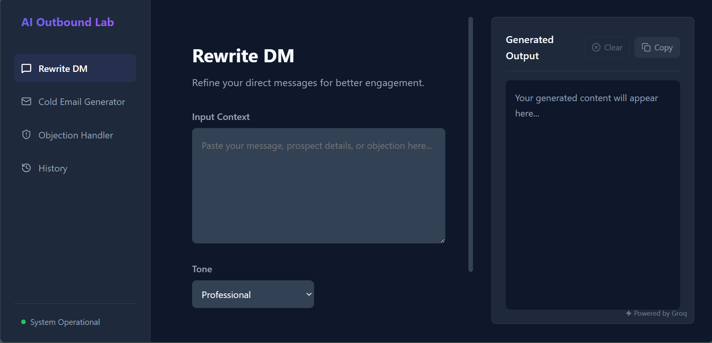
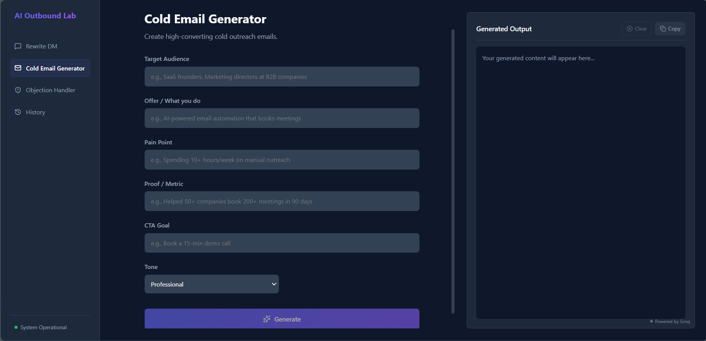
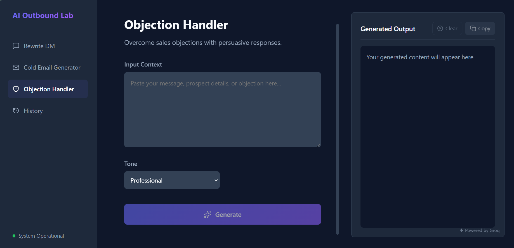
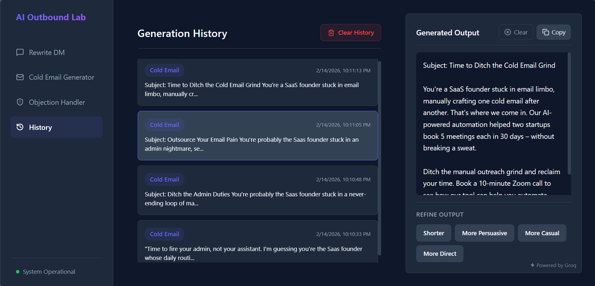

# AI Outbound Lab

> AI-powered messaging toolkit for cold outreach, DM rewrites, and objection handling.

AI Outbound Lab is a production-ready web application that helps sales teams and founders generate high-converting outbound messages using AI. Built with React, Node.js, and Groq's LLM API.

---

## Screenshots

### Rewrite DM


### Cold Email Generator


### Objection Handler


### History


---

## Features

### 🎯 Core Tools
- **Rewrite DM** - Refine LinkedIn/Twitter DMs for better engagement
- **Cold Email Generator** - Create personalized cold emails with structured inputs (Target, Offer, Pain Point, Proof, CTA)
- **Objection Handler** - Generate persuasive responses to common sales objections

### ✨ AI Refinements
- **Shorter** - Condense messages while keeping key points
- **More Persuasive** - Increase conversion potential
- **More Casual** - Adjust tone for informal contexts
- **More Direct** - Cut fluff and get straight to the point

### 💾 Persistence
- **History Storage** - All generations saved to localStorage
- **One-Click Reload** - Load past outputs and switch tools instantly
- **Clear History** - Bulk delete with confirmation

### ⚡ Performance
- **Groq LLM Integration** - Fast inference with llama-3.1-8b-instant
- **Loading States** - Visual feedback during generation
- **Responsive Design** - Works on desktop and mobile

---

## Tech Stack

### Frontend
- **React** - UI framework
- **Vite** - Build tool and dev server
- **Lucide React** - Icon library
- **CSS Variables** - Dark SaaS theme

### Backend
- **Node.js** - Runtime
- **Express** - Web framework
- **Groq SDK** - LLM API client
- **CORS** - Cross-origin support

### Infrastructure
- **localStorage** - Client-side persistence
- **Environment Variables** - Configuration management

---

## Architecture

```
ai-outbound-lab/
├── src/                    # Frontend (React + Vite)
│   ├── components/
│   │   ├── Sidebar.jsx
│   │   ├── ToolView.jsx
│   │   ├── OutputPanel.jsx
│   │   └── History.jsx
│   ├── App.jsx
│   └── index.css
├── backend/                # Backend (Node.js + Express)
│   ├── server.js
│   ├── package.json
│   └── .env
├── assets/                 # Screenshots
└── .env                    # Frontend environment variables
```

**Data Flow:**
1. User inputs text and selects tone
2. Frontend sends request to `/generate` endpoint
3. Backend constructs prompt and calls Groq API
4. Response streamed back to frontend
5. Output displayed and saved to localStorage

---

## Setup

### Prerequisites
- Node.js 18+
- npm or yarn
- Groq API key ([get one here](https://console.groq.com))

### Installation

1. **Clone the repository**
   ```bash
   git clone https://github.com/lordporus/ai-outbound-lab.git
   cd ai-outbound-lab
   ```

2. **Install frontend dependencies**
   ```bash
   npm install
   ```

3. **Install backend dependencies**
   ```bash
   cd backend
   npm install
   ```

4. **Configure environment variables**

   Create `backend/.env`:
   ```env
   GROQ_API_KEY=your_groq_api_key_here
   PORT=5000
   ```

   Create `.env` (frontend root):
   ```env
   VITE_API_URL=http://localhost:5000
   ```

5. **Start the backend**
   ```bash
   cd backend
   node server.js
   ```

6. **Start the frontend** (in a new terminal)
   ```bash
   npm run dev
   ```

7. **Open the app**
   ```
   http://localhost:5173
   ```

---

## Environment Variables

### Backend (`backend/.env`)
| Variable | Description | Required |
|----------|-------------|----------|
| `GROQ_API_KEY` | Your Groq API key | Yes |
| `PORT` | Backend server port | No (default: 5000) |

### Frontend (`.env`)
| Variable | Description | Required |
|----------|-------------|----------|
| `VITE_API_URL` | Backend API URL | No (default: http://localhost:5000) |

---

## Deployment

### Frontend (Vercel/Netlify)
1. Build the frontend:
   ```bash
   npm run build
   ```
2. Deploy the `dist/` folder
3. Set `VITE_API_URL` to your production backend URL

### Backend (Railway/Render/Fly.io)
1. Deploy `backend/` directory
2. Set `GROQ_API_KEY` environment variable
3. Ensure `PORT` is set by the platform or defaults to 5000

### CORS Configuration
Update `backend/server.js` to allow your frontend domain:
```javascript
app.use(cors({
  origin: 'https://ai-outbound-lab.vercel.app/'
}));
```

---

## Future Roadmap

- [ ] **User Authentication** - Save history to cloud with user accounts
- [ ] **Team Collaboration** - Share templates and outputs
- [ ] **A/B Testing** - Compare multiple variations
- [ ] **Analytics Dashboard** - Track generation metrics
- [ ] **Custom Prompts** - User-defined system prompts
- [ ] **Export to CRM** - Direct integration with HubSpot, Salesforce
- [ ] **Multi-language Support** - Generate in Spanish, French, German
- [ ] **Voice Input** - Speak your inputs instead of typing

---

## License

MIT

---

## Contributing

Pull requests are welcome. For major changes, please open an issue first to discuss what you would like to change.

---

Built with ⚡ by porus
